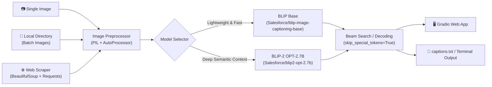

# Image Captioning with Generative AI & Vision-Language Models

[](https://www.python.org/)
[](https://pytorch.org/)
[](https://huggingface.co/)
[](https://gradio.app/)
[](https://github.com/salesforce/BLIP)
[](LICENSE)

An end-to-end multimodal Generative AI project for automated image understanding and natural language captioning. This repository integrates state-of-the-art Vision-Language Models (**Salesforce BLIP** and **BLIP-2**) to deliver real-time web inference, command-line processing, batch folder workflows, and automated web-scraping caption pipelines.

---

## Key Features

- **Interactive Web Application (Gradio)**: Drag-and-drop graphical user interface for instant, browser-based image captioning.
- **Single-Image Inference**: Quick standalone script to load and generate descriptive captions for individual images with optional prompt conditioning.
- **Automated Batch Folder Captioner**: Scans local directories for `.jpg`, `.jpeg`, and `.png` assets, batch-processing captions powered by **BLIP-2 OPT-2.7B**.
- **Web Scraper & URL Captioner**: Crawls live web pages (e.g., Wikipedia), automatically filters and downloads embedded images, and generates catalogued image-caption pairs saved to disk.
- **Multimodal Vision-Language Architectures**:
  - **BLIP (`Salesforce/blip-image-captioning-base`)**: High efficiency, low latency, ideal for edge deployment and interactive applications.
  - **BLIP-2 (`Salesforce/blip2-opt-2.7b`)**: Q-Former architecture coupled with an OPT LLM for deeper semantic understanding and descriptive outputs.

---

## Architecture & Pipeline Flow

The system processes visual inputs through a deep vision transformer and decodes multimodal tokens into natural English language:



---

## Repository Structure

```text
imageCaptioning-generativeAI/
│
├── image_captioning_app.py         # Gradio-based interactive web interface
├── image_cap.py                    # Standalone single-image captioning script (BLIP)
├── automate_localFolder_captioner.py # Batch processor for local image directories (BLIP-2)
├── automate_url_captioner.py       # Web crawler & automated image captioning pipeline
│
├── captions.txt                    # Sample output of generated captions from web scraping
├── images.jfif                     # Sample test image
├── requirements.txt                # Python package dependencies
├── .gitignore                      # Git ignore rules for environments and temporary files
└── README.md                       # Project documentation and showcase
```

---

## Getting Started

### Prerequisites

- **Python**: Version `3.10` or higher
- **Hardware**: CPU supported; NVIDIA GPU with CUDA recommended for optimal BLIP-2 inference speed.

### Installation

1. **Clone the repository:**
   ```bash
   git clone https://github.com/<your-username>/imageCaptioning-generativeAI.git
   cd imageCaptioning-generativeAI
   ```

2. **Create and activate a virtual environment:**
   - **Windows:**
     ```powershell
     python -m venv my_env
     .\my_env\Scripts\activate
     ```
   - **Linux / macOS:**
     ```bash
     python3 -m venv my_env
     source my_env/bin/activate
     ```

3. **Install the dependencies:**
   ```bash
   pip install -r requirements.txt
   ```

   *(Optional: If using an NVIDIA GPU, ensure PyTorch is installed with CUDA support from [pytorch.org](https://pytorch.org/get-started/locally/).)*

---

## Usage

### 1. Launch the Gradio Web Application

Run the interactive browser interface:
```bash
python image_captioning_app.py
```
Open your browser and navigate to `http://127.0.0.1:7860`. Upload any image to view its generated caption in real-time.

---

### 2. Single-Image Captioning (CLI)

Caption a local image directly from the command line:
```bash
python image_cap.py
```
*Note: Make sure `img_path` inside `image_cap.py` points to your target file (e.g., `images.jfif`).*

---

### 3. Batch Captioning Local Folders (BLIP-2)

Process an entire directory of images with high-capacity BLIP-2:
```bash
python automate_localFolder_captioner.py
```
- Configure `image_dir` inside the script to point to your desired directory (e.g., `C:\temp` or `./dataset`).
- Results are saved to `captions_local.txt` in the format:
  ```text
  photo_01.jpg: a dog running through a grassy field
  photo_02.png: a vintage sports car parked near the coastline
  ```

---

### 4. Automated Web Scraping & URL Captioner

Scrape all images from an article or website and produce a captioned dataset:
```bash
python automate_url_captioner.py
```
- Fetches HTML content via `requests` and parses `` tags via `BeautifulSoup`.
- Filters invalid formats (SVGs, thumbnails below threshold).
- Streams images into memory (`io.BytesIO`) and generates captions.
- Saves the mapped outputs to `captions_url.txt`.

---

## Sample Outputs

Below are examples of real captions generated by this project from Wikipedia articles (see `captions.txt`):

| Source Image Type | Generated Caption |
| :--- | :--- |
| **Corporate Headquarters** | *"the image of a building"* |
| **Vintage Computing Lab** | *"the image of a man working in a computer lab"* |
| **Apollo Saturn IB Instrument** | *"the image of a space shuttle is shown in the text"* |
| **IBM Personal Computer (PC)** | *"the image of a computer with a keyboard"* |
| **Quantum Computing System** | *"the image of a room with a black floor"* |
| **Data Visualization & Chips** | *"the image of a computer chip and a green chip"* |

---

## Configuration & Customization

### Prompt Conditioning Prefix
BLIP supports conditional text prefixes. Adding a prompt prefix guides the generator:
```python
# Unconditional captioning
inputs = processor(images=image, return_tensors="pt")

# Conditional prefix captioning
inputs = processor(images=image, text="a photography of", return_tensors="pt")
```

### Text Generation Parameters
Fine-tune caption diversity, length, and quality by passing generation parameters:
```python
outputs = model.generate(
    **inputs,
    max_new_tokens=60,
    num_beams=5,             # Beam search for higher quality
    early_stopping=True,
    temperature=0.7          # Controls randomness
)
```

### GPU Acceleration
To leverage GPU acceleration, transfer the model and tensors to CUDA:
```python
import torch

device = "cuda" if torch.cuda.is_available() else "cpu"
model = model.to(device)
inputs = {k: v.to(device) for k, v in inputs.items()}
```

---

⭐ If you found this project helpful, consider giving it a star on GitHub!

